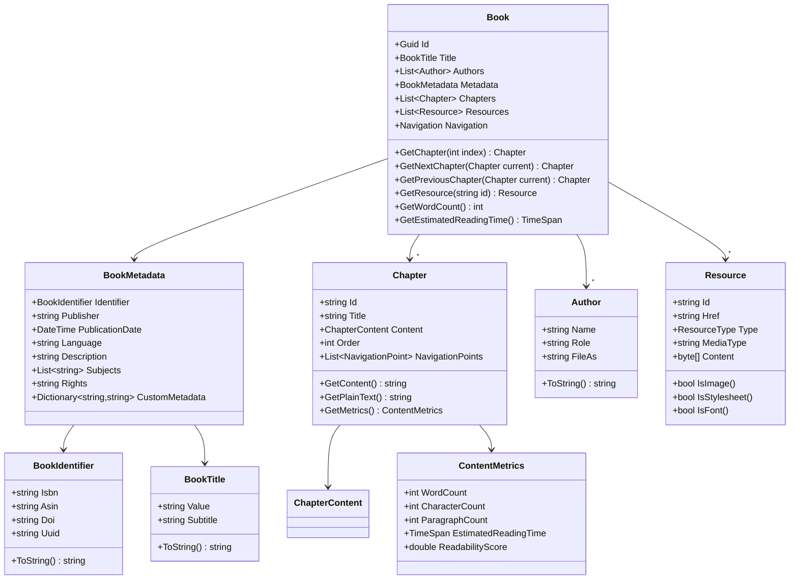
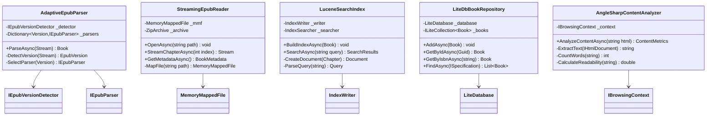
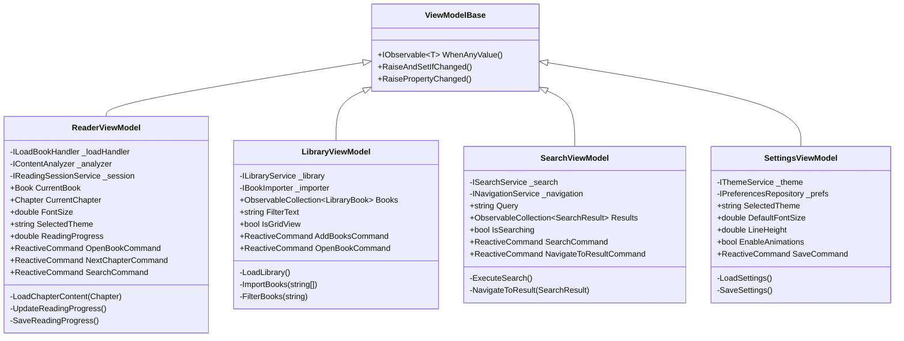
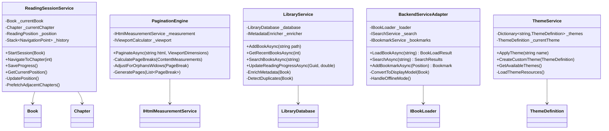
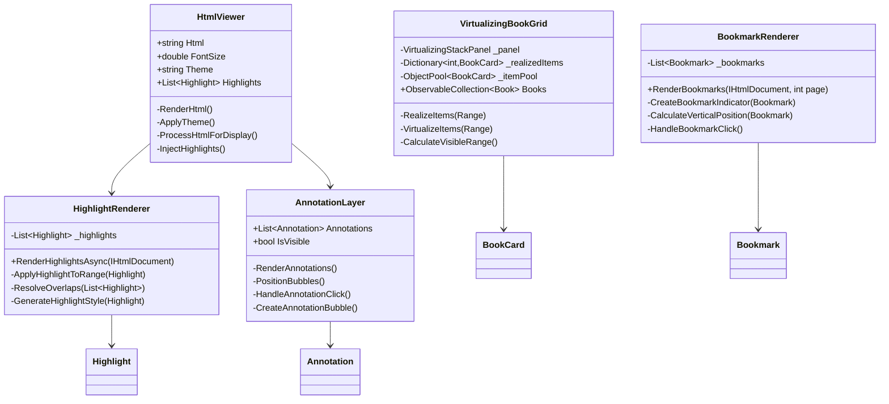
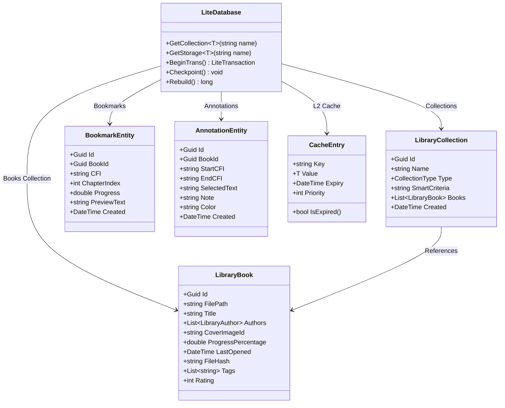
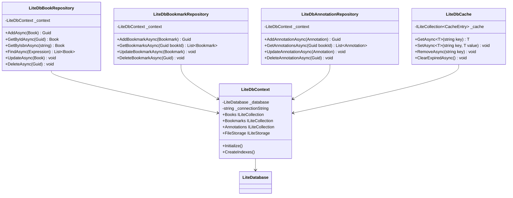
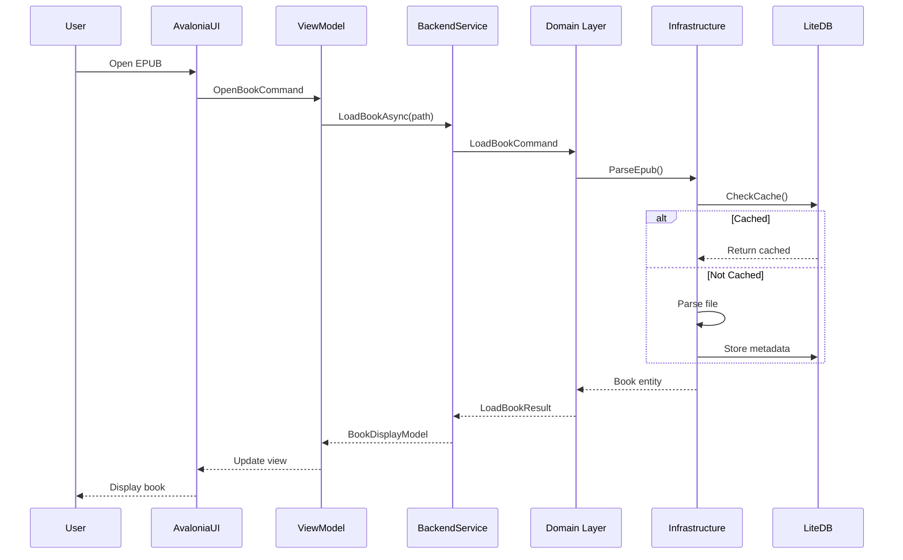
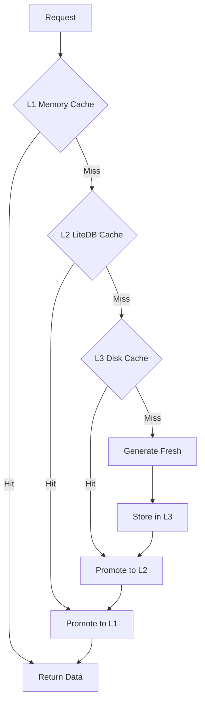

# Alexandria Master Architecture

## Executive Summary

Alexandria is a .NET 9.0-based EPUB reader library implementing Domain-Driven Design (DDD) with a Vertical Slice Architecture. The project provides comprehensive EPUB parsing, content analysis, and reading session management capabilities with planned cross-platform UI support via AvaloniaUI.

## Project Status

- **Backend**: Core EPUB parsing and domain logic ✅ Implemented
- **Frontend**: AvaloniaUI application 🚧 Planned
- **Architecture Migration**: Moving from layered to vertical slice architecture 🔄 In Progress

## Directory Structure

```
Alexandria/
├── src/                                    # Source code
│   ├── Alexandria.Domain/                 # Domain layer (pure business logic)
│   │   ├── Common/                        # Shared domain abstractions
│   │   ├── Entities/                      # Domain entities (Book, Chapter)
│   │   ├── Enums/                         # Domain enumerations
│   │   ├── Errors/                        # Domain error types
│   │   ├── Exceptions/                    # Domain exceptions
│   │   ├── Repositories/                  # Repository interfaces
│   │   ├── Services/                      # Domain service interfaces
│   │   ├── Specifications/                # Specification pattern implementations
│   │   └── ValueObjects/                  # Value objects (Author, BookTitle, etc.)
│   │
│   ├── Alexandria.Application/            # Application layer (use cases)
│   │   ├── Common/                        # Shared application logic
│   │   ├── Features/                      # Vertical slices
│   │   │   └── LoadBook/                  # Book loading feature
│   │   │       ├── LoadBookCommand.cs     # Command/Request
│   │   │       ├── LoadBookHandler.cs     # Business logic
│   │   │       ├── LoadBookValidator.cs   # Input validation
│   │   │       └── LoadBookResult.cs      # Response
│   │   ├── Interfaces/                    # Application service interfaces
│   │   └── Services/                      # Application services
│   │
│   └── Alexandria.Infrastructure/         # Infrastructure layer (external concerns)
│       ├── Caching/                       # Memory caching implementations
│       ├── ContentProcessing/             # HTML/CSS processing
│       ├── FileSystem/                    # File system operations
│       │   ├── Models/                    # Infrastructure models
│       │   └── Parsers/                   # EPUB parser implementations
│       │       ├── Models/                 # Parser-specific models
│       │       │   ├── Epub2/              # EPUB 2 format models
│       │       │   └── Epub3/              # EPUB 3 format models
│       │       ├── AdaptiveEpubParser.cs  # Auto-detecting parser
│       │       ├── Epub2Parser.cs         # EPUB 2.0 parser
│       │       ├── Epub3Parser.cs         # EPUB 3.0 parser
│       │       ├── EpubParserFactory.cs   # Parser factory
│       │       └── EpubVersionDetector.cs # Version detection
│       ├── IO/                            # I/O operations
│       │   ├── EpubResourceExtractor.cs   # Resource extraction
│       │   └── StreamingEpubReader.cs     # Large file streaming
│       ├── Persistence/                   # Data persistence
│       │   └── EpubLoader.cs              # Main loading orchestrator
│       └── Services/                      # Infrastructure services
│           └── AngleSharpContentAnalyzer.cs # HTML content analysis
│
├── tests/                                  # Test projects
│   ├── Alexandria.Domain.Tests/           # Domain unit tests
│   ├── Alexandria.Application.Tests/      # Application layer tests
│   ├── Alexandria.Infrastructure.Tests/   # Infrastructure tests
│   │   └── sample-epubs/                  # Test EPUB files
│   ├── Alexandria.Benchmarks/             # Performance benchmarks
│   └── Alexandria.Repositories.Tests/     # Repository integration tests
│
├── Alexandria.sln                         # Solution file
├── ALEXANDRIA-SYSTEM-ARCHITECTURE.md      # Detailed system architecture
├── AVALONIA-FRONTEND-ARCHITECTURE.md      # Frontend architecture plans
└── CLAUDE.md                              # AI assistant instructions
```

## Technology Stack

### Core Framework

- **.NET 9.0** - Target framework (using preview version)
- **C# 13** - Programming language with nullable reference types enabled
- **ImplicitUsings** - Enabled for cleaner code

### Domain Layer

| Package | Version | Purpose |
|---------|---------|---------|
| OneOf | 3.0.271 | Discriminated unions for result types |

### Application Layer

| Package | Version | Purpose |
|---------|---------|---------|
| MediatR | 13.0.0 | CQRS pattern implementation |
| FluentValidation | 12.0.0 | Input validation |

### Infrastructure Layer

| Package | Version | Purpose |
|---------|---------|---------|
| AngleSharp | 1.3.0 | HTML/CSS parsing and DOM manipulation |
| LiteDB | 5.0.21 | NoSQL embedded database |
| SharpZipLib | 1.4.2 | ZIP archive handling for EPUB files |
| Microsoft.Extensions.Caching.Memory | 9.0.9 | In-memory caching |
| Microsoft.Extensions.DependencyInjection | 9.0.9 | Dependency injection |
| Microsoft.Extensions.Logging | 9.0.9 | Logging abstractions |
| Microsoft.Extensions.Configuration | 9.0.9 | Configuration management |
| Microsoft.Extensions.Options | 9.0.9 | Options pattern |

### Testing Stack

| Package | Version | Purpose |
|---------|---------|---------|
| TUnit | Latest | Unit testing framework |
| Moq | Latest | Mocking framework |
| BenchmarkDotNet | Latest | Performance benchmarking |

### Planned Frontend Stack (AvaloniaUI)

| Package | Purpose |
|---------|---------|
| Avalonia | Cross-platform UI framework |
| Avalonia.ReactiveUI | MVVM support |
| Avalonia.HtmlRenderer | HTML content rendering |
| Material.Avalonia | Material Design components |
| Lucene.NET | Full-text search (planned) |

## Architectural Patterns

### 1. Domain-Driven Design (DDD)

- **Rich Domain Models**: Entities contain business logic
- **Value Objects**: Immutable objects for concepts (Author, BookTitle)
- **Domain Services**: Cross-entity operations (IContentAnalyzer)
- **Repository Pattern**: Data access abstraction
- **Specification Pattern**: Reusable query logic

### 2. Vertical Slice Architecture

- **Feature-Based Organization**: Each feature is self-contained
- **CQRS Pattern**: Command/Query separation with MediatR
- **Request/Handler/Response**: Clear flow for each use case
- **Minimal Cross-Feature Dependencies**: Features are isolated

### 3. Clean Architecture Principles

- **Dependency Inversion**: Domain doesn't depend on infrastructure
- **Interface Segregation**: Small, focused interfaces
- **Single Responsibility**: Each class has one reason to change
- **Open/Closed**: Open for extension, closed for modification

## Key Components

### Domain Entities

```
Book (Aggregate Root)
├── Metadata (Value Object)
├── Chapters (Collection)
├── Resources (Images, CSS, Fonts)
└── Navigation (Table of Contents)

Chapter (Entity)
├── Title
├── Content (HTML)
├── Order
└── Navigation Points
```

### Core Services

#### Domain Services

- `IEpubLoader` - Main EPUB loading interface
- `IContentAnalyzer` - Content metrics and analysis
- `IBookRepository` - Book persistence abstraction

#### Infrastructure Services

- `AdaptiveEpubParser` - Auto-detects EPUB version
- `StreamingEpubReader` - Handles large EPUB files
- `AngleSharpContentAnalyzer` - HTML processing
- `BookCache` - In-memory caching with LRU eviction

### Loading Strategy

```
File Size → Strategy
< 10MB   → Eager Loading (full in-memory)
10-50MB  → Adaptive (based on available memory)
> 50MB   → Streaming (on-demand chapter loading)
```

## Current Implementation Status

### ✅ Implemented

- EPUB 2.0/3.0 parsing with adaptive detection
- Domain model with rich entities and value objects
- Vertical slice for LoadBook feature
- Content analysis with AngleSharp
- Basic caching infrastructure
- Streaming support for large files
- MediatR integration for CQRS

### 🔄 In Progress

- Moving from layered to vertical slice architecture
- Consolidating duplicate parsing implementations
- Implementing proper streaming adapter pattern

### 🚧 Planned

- Search functionality with Lucene.NET
- Bookmark and annotation persistence
- Reading progress tracking
- AvaloniaUI frontend application
- Library management with LiteDB
- Multi-tier caching strategy

## Build Configuration

### Solution Configuration

- **Debug/Release** configurations
- **Multiple platforms**: Any CPU, ARM, ARM64, x64, x86
- **9 projects** total (3 source, 6 test)

### Known Issues

- MediatR version mismatch warning (using 13.0.0 with extensions expecting 11.0.0)
- Using .NET 10 preview SDK (backwards compatible)

## Development Workflow

### Building

```bash
# Build entire solution
dotnet build

# Run tests
dotnet test

# Run benchmarks
dotnet run -c Release --project tests/Alexandria.Benchmarks
```

### Testing Strategy

- **Unit Tests**: Domain and application logic
- **Integration Tests**: Infrastructure components
- **Benchmark Tests**: Performance critical paths
- **Sample EPUBs**: Real-world test files in `tests/Alexandria.Infrastructure.Tests/sample-epubs/`

## Architecture Decision Records

### ADR-001: Vertical Slice Architecture

**Decision**: Migrate from traditional layered architecture to vertical slices
**Rationale**: Better feature isolation, easier to understand and modify individual features
**Status**: In progress

### ADR-002: Streaming for Large Files

**Decision**: Implement streaming reader for files >50MB
**Rationale**: Prevent memory exhaustion with large EPUB files
**Status**: Implemented

### ADR-003: AvaloniaUI for Frontend

**Decision**: Use AvaloniaUI for cross-platform UI
**Rationale**: True cross-platform support, XAML-based, familiar to WPF developers
**Status**: Planned

### ADR-004: OneOf for Result Types

**Decision**: Use OneOf library for discriminated unions
**Rationale**: Type-safe error handling without exceptions
**Status**: Implemented

## Backend Class Diagrams

### Domain Layer Architecture



### Application Layer Architecture

```mermaid
classDiagram
    class LoadBookHandler {
        -IEpubLoader _loader
        -IBookCache _cache
        -IContentAnalyzer _analyzer
        +HandleAsync(LoadBookCommand) LoadBookResult
        -ValidateFile(string path) bool
        -CheckCache(string path) Book
        -AnalyzeContent(Book book) void
    }

    class SearchContentHandler {
        -ISearchIndex _index
        -IBookRepository _repository
        +HandleAsync(SearchContentQuery) SearchResults
        -BuildIndexIfNeeded(BookId) void
        -ExecuteSearch(string query) List~Match~
        -RankResults(List~Match~) List~SearchResult~
    }

    class BookmarkHandler {
        -IBookmarkRepository _repository
        -IPositionCalculator _calculator
        +HandleAsync(AddBookmarkCommand) BookmarkResult
        -CalculatePosition(ViewportInfo) Position
        -GeneratePreview(Position) string
        -ValidateBookmark(Bookmark) bool
    }

    class NavigateHandler {
        -INavigationService _navigation
        -IReadingSessionService _session
        +HandleAsync(NavigateCommand) NavigationResult
        -UpdateHistory(NavigationPoint) void
        -LoadChapter(ChapterIndex) Chapter
        -UpdateProgress(Position) void
    }

    class AnnotateHandler {
        -IAnnotationRepository _repository
        -ITextSelector _selector
        +HandleAsync(AddAnnotationCommand) AnnotationResult
        -ExtractSelection(Range) TextSelection
        -CreateHighlight(Selection) Highlight
        -SaveAnnotation(Annotation) void
    }

    LoadBookHandler --> IEpubLoader
    LoadBookHandler --> IBookCache
    LoadBookHandler --> IContentAnalyzer
    SearchContentHandler --> ISearchIndex
    SearchContentHandler --> IBookRepository
    BookmarkHandler --> IBookmarkRepository
    NavigateHandler --> INavigationService
    AnnotateHandler --> IAnnotationRepository
```



### Infrastructure Layer Architecture



## Frontend Class Diagrams

### ViewModel Architecture



### Service Layer Architecture



### Custom Controls Architecture



## LiteDB Storage Architecture

### Database Schema



### Repository Implementation



## Complete System Integration

### Data Flow Architecture



### Caching Strategy



## Implementation Roadmap

### Phase 1: Core Infrastructure ✅ (Completed)

- [x] Domain entities and value objects
- [x] Basic EPUB parsing (2.0/3.0)
- [x] LoadBook vertical slice
- [x] Content analysis with AngleSharp
- [x] Basic caching infrastructure

### Phase 2: Backend Completion 🔄 (In Progress)

- [ ] Fix architectural violations
- [ ] Implement StreamingEpubReaderAdapter
- [ ] Complete Search infrastructure with Lucene.NET
- [ ] Implement LiteDB repositories
- [ ] Add remaining vertical slices (Navigate, Bookmark, Annotate)

### Phase 3: Frontend Foundation 🚧 (Planned)

- [ ] Create Alexandria.UI project
- [ ] Implement base ViewModels
- [ ] Create main window and navigation
- [ ] Implement HtmlViewer control
- [ ] Basic reader view

### Phase 4: Library Management 🚧 (Planned)

- [ ] Library database with LiteDB
- [ ] Book import pipeline
- [ ] Metadata enrichment
- [ ] Duplicate detection
- [ ] Collections and tagging

### Phase 5: Reading Experience 🚧 (Planned)

- [ ] Pagination engine
- [ ] Reading session management
- [ ] Bookmarks and annotations
- [ ] Search and highlighting
- [ ] Progress tracking

### Phase 6: Polish & Optimization 🚧 (Planned)

- [ ] Multi-tier caching
- [ ] Virtual scrolling
- [ ] Background processing
- [ ] Memory management
- [ ] Performance optimization

### Phase 7: Advanced Features 🚧 (Future)

- [ ] Cloud sync
- [ ] Export functionality
- [ ] Plugin architecture
- [ ] Mobile support
- [ ] WebAssembly deployment

## Technology Summary

### Backend Stack

- **.NET 9.0** - Core framework
- **MediatR** - CQRS implementation
- **FluentValidation** - Input validation
- **AngleSharp** - HTML/CSS processing
- **SharpZipLib** - EPUB extraction
- **Lucene.NET** - Full-text search
- **LiteDB** - NoSQL database for all storage
- **OneOf** - Discriminated unions

### Frontend Stack

- **AvaloniaUI 11.0** - Cross-platform UI
- **ReactiveUI** - MVVM framework
- **Avalonia.HtmlRenderer** - HTML rendering
- **Material.Avalonia** - Material Design
- **LiteDB** - Local storage

### Testing Stack

- **TUnit** - Unit testing
- **Moq** - Mocking
- **BenchmarkDotNet** - Performance
- **Avalonia.Headless** - UI testing

## Next Steps

1. **Complete Backend Refactoring**
   - Fix StreamingEpubReader integration
   - Implement missing domain services
   - Complete LiteDB repositories

2. **Start Frontend Implementation**
   - Create Alexandria.UI project
   - Implement core ViewModels
   - Build reader interface

3. **Integrate Search System**
   - Implement Lucene.NET indexing
   - Build search UI
   - Add highlighting support

4. **Complete Storage Layer**
   - Implement all LiteDB repositories
   - Add caching layers
   - Build import pipeline

## Key Architectural Decisions

### Storage Strategy

**LiteDB for Everything**: We use LiteDB as our primary storage solution for:

- Library catalog and metadata
- Bookmarks and annotations
- Reading progress and statistics
- User preferences
- L2 cache layer
- Cover image storage (FileStorage)

This provides a consistent, embedded NoSQL database that works across all platforms without external dependencies.

### Loading Strategy

- **Small files (<10MB)**: Eager loading into memory
- **Medium files (10-50MB)**: Adaptive based on available memory
- **Large files (>50MB)**: Streaming with memory-mapped files

### Search Architecture

- **Lucene.NET** for full-text indexing
- **On-demand indexing** for large books
- **Real-time search** fallback when index unavailable
- **LiteDB** for storing search index metadata

### Frontend Architecture

- **AvaloniaUI** for true cross-platform support
- **MVVM** with ReactiveUI for clean separation
- **CSS columns** for pagination
- **Virtual scrolling** for large libraries

## References

- [ALEXANDRIA-SYSTEM-ARCHITECTURE.md](./ALEXANDRIA-SYSTEM-ARCHITECTURE.md) - Detailed system design
- [AVALONIA-FRONTEND-ARCHITECTURE.md](./AVALONIA-FRONTEND-ARCHITECTURE.md) - Frontend plans
- [CLAUDE.md](./CLAUDE.md) - Development guidelines

---

*This document serves as the complete architectural blueprint for the Alexandria EPUB Reader project, consolidating all design decisions, implementation details, and technical specifications.*
