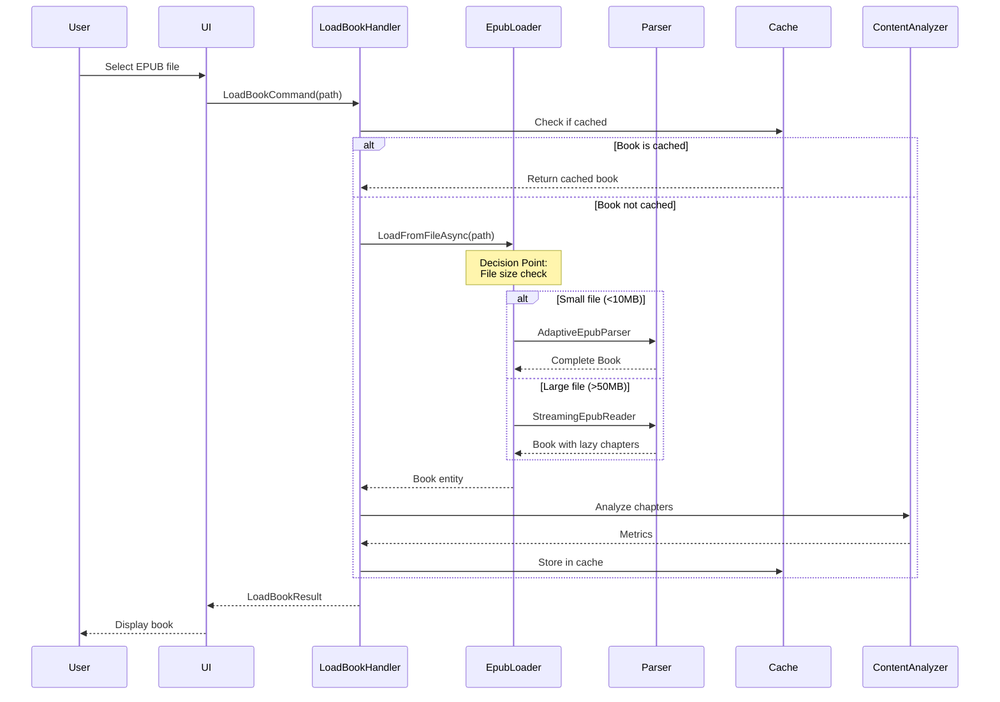
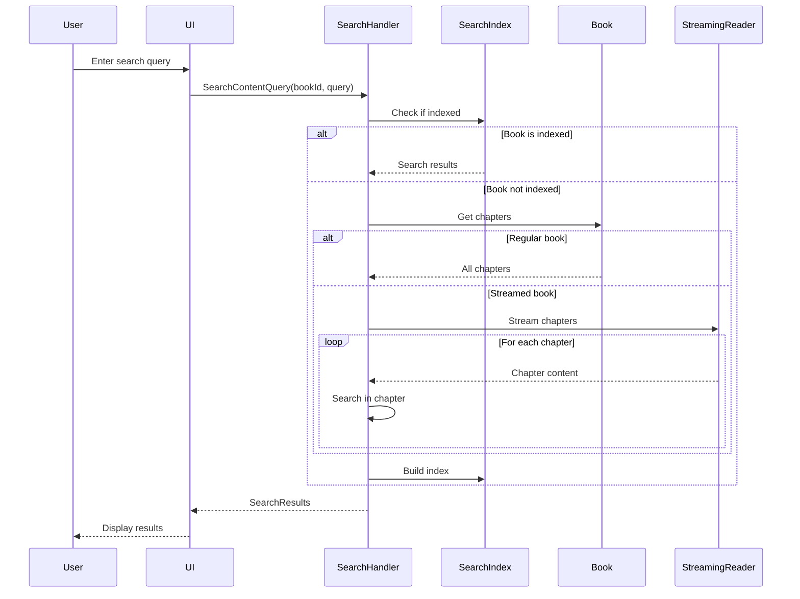
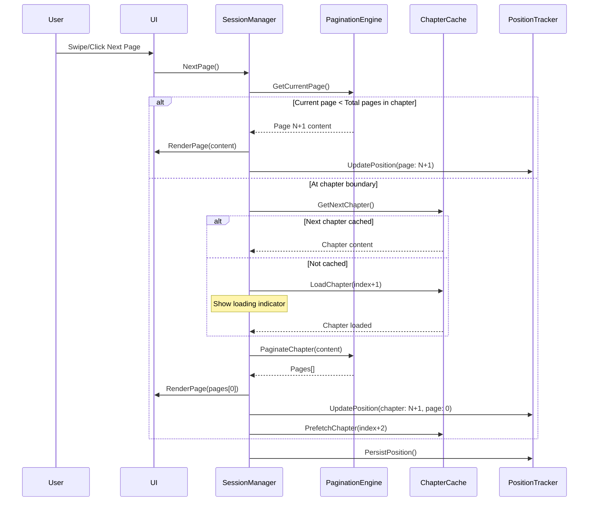
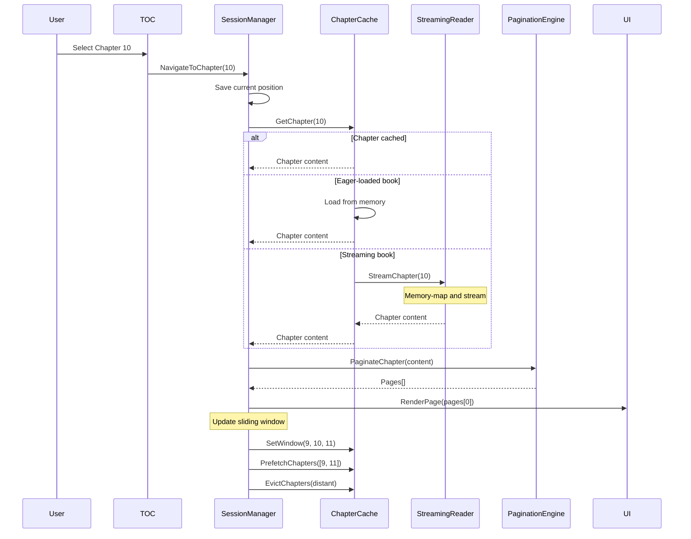
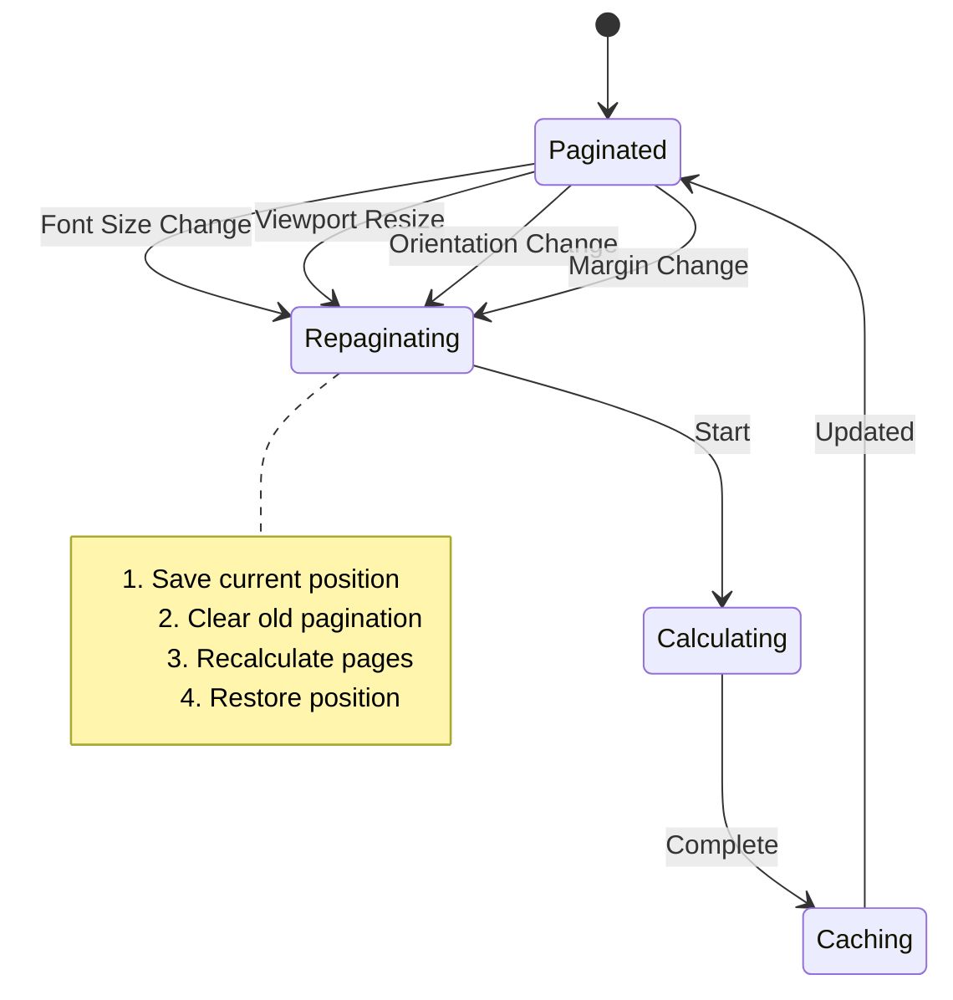
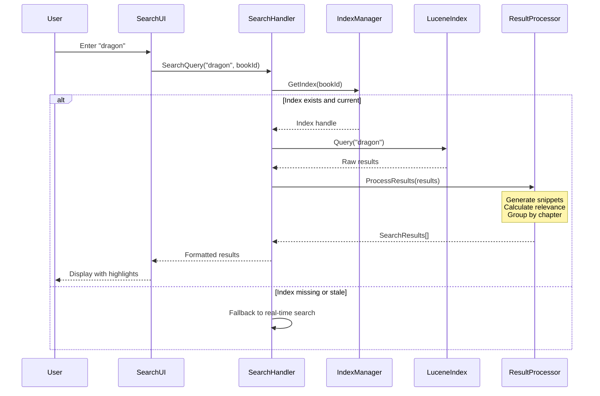
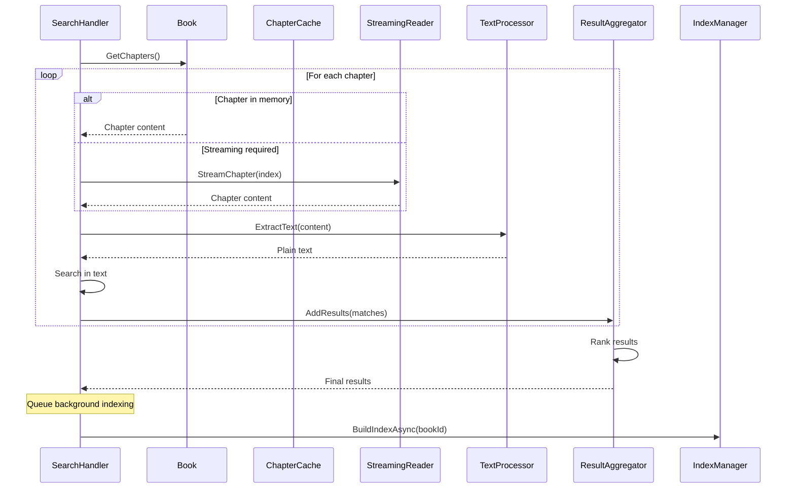
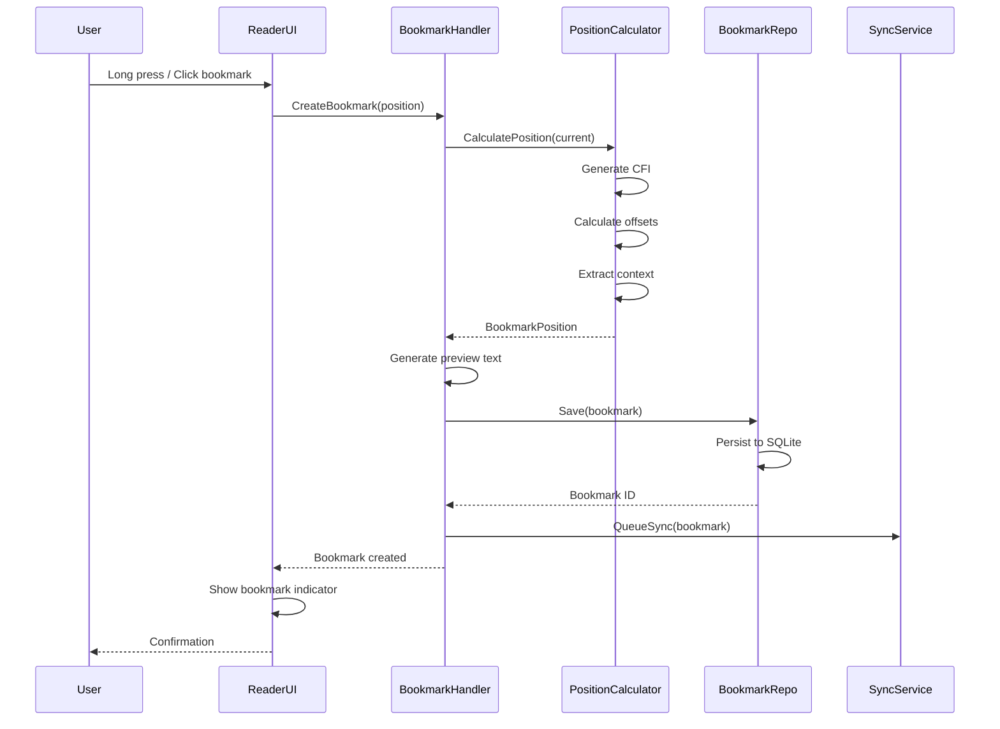
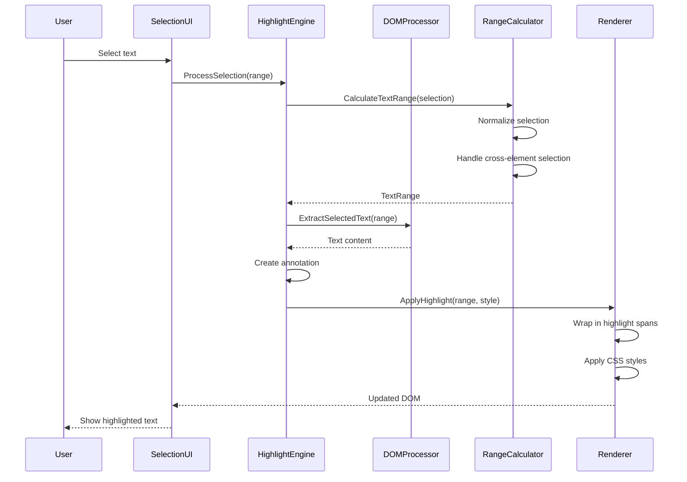

# Alexandria System Architecture

## Purpose

This document is the **single source of truth** for Alexandria's complete system architecture. It defines how all components interact, where each feature belongs, and how data flows through the system. Every architectural decision should reference this document.

## System Overview

```
┌─────────────────────────────────────────────────────────────────────┐
│                        Alexandria EPUB Reader                        │
├─────────────────────────────────────────────────────────────────────┤
│                                                                      │
│  ┌──────────────────────────────────────────────────────────────┐  │
│  │                    Presentation Layer                         │  │
│  │  ┌─────────────┐  ┌─────────────┐  ┌──────────────┐        │  │
│  │  │ AvaloniaUI  │  │   Console   │  │   Web API    │        │  │
│  │  └─────────────┘  └─────────────┘  └──────────────┘        │  │
│  └──────────────────────────────────────────────────────────────┘  │
│                               ▼                                     │
│  ┌──────────────────────────────────────────────────────────────┐  │
│  │                    Application Layer                          │  │
│  │                   (Vertical Slices)                          │  │
│  │  ┌─────────────┐  ┌─────────────┐  ┌──────────────┐        │  │
│  │  │  LoadBook   │  │SearchContent│  │  Navigate    │        │  │
│  │  │   Handler   │  │   Handler   │  │   Handler    │        │  │
│  │  └─────────────┘  └─────────────┘  └──────────────┘        │  │
│  │  ┌─────────────┐  ┌─────────────┐  ┌──────────────┐        │  │
│  │  │  Annotate   │  │  Bookmark   │  │   Export     │        │  │
│  │  │   Handler   │  │   Handler   │  │   Handler    │        │  │
│  │  └─────────────┘  └─────────────┘  └──────────────┘        │  │
│  └──────────────────────────────────────────────────────────────┘  │
│                               ▼                                     │
│  ┌──────────────────────────────────────────────────────────────┐  │
│  │                      Domain Layer                            │  │
│  │  ┌─────────────┐  ┌─────────────┐  ┌──────────────┐        │  │
│  │  │    Book     │  │   Content   │  │  Navigation  │        │  │
│  │  │  Aggregate  │  │   Domain    │  │   Domain     │        │  │
│  │  └─────────────┘  └─────────────┘  └──────────────┘        │  │
│  │  ┌─────────────┐  ┌─────────────┐  ┌──────────────┐        │  │
│  │  │  Resource   │  │   Search    │  │  Progress    │        │  │
│  │  │   Domain    │  │   Domain    │  │   Domain     │        │  │
│  │  └─────────────┘  └─────────────┘  └──────────────┘        │  │
│  └──────────────────────────────────────────────────────────────┘  │
│                               ▼                                     │
│  ┌──────────────────────────────────────────────────────────────┐  │
│  │                   Infrastructure Layer                       │  │
│  │  ┌─────────────┐  ┌─────────────┐  ┌──────────────┐        │  │
│  │  │EPUB Parsers │  │Content Proc │  │   Caching    │        │  │
│  │  │(Adaptive,   │  │(AngleSharp, │  │  (Memory,    │        │  │
│  │  │ Streaming)  │  │ ExCSS)      │  │   LiteDB)    │        │  │
│  │  └─────────────┘  └─────────────┘  └──────────────┘        │  │
│  │  ┌─────────────┐  ┌─────────────┐  ┌──────────────┐        │  │
│  │  │Search Index │  │ Persistence │  │File System   │        │  │
│  │  │(Lucene.NET) │  │  (SQLite)   │  │   Access     │        │  │
│  │  └─────────────┘  └─────────────┘  └──────────────┘        │  │
│  └──────────────────────────────────────────────────────────────┘  │
│                                                                      │
└─────────────────────────────────────────────────────────────────────┘
```

## Core User Scenarios

### Scenario 1: Load and Read EPUB



### Scenario 2: Search Within Book



## Component Registry

### Application Layer Components

| Component | Responsibility | Inputs | Outputs | Dependencies |
|-----------|---------------|---------|---------|--------------|
| LoadBookHandler | Orchestrates book loading | LoadBookCommand | LoadBookResult | IEpubLoader, IBookCache, IContentAnalyzer |
| SearchContentHandler | Handles content search | SearchContentQuery | SearchResults | ISearchIndex, IBookRepository |
| NavigateHandler | Manages navigation | NavigateCommand | NavigationResult | INavigationService |
| AnnotateHandler | Manages annotations | AnnotateCommand | AnnotationResult | IAnnotationRepository |
| BookmarkHandler | Manages bookmarks | BookmarkCommand | BookmarkResult | IBookmarkRepository |

### Domain Layer Components

| Component | Type | Responsibility | Key Methods |
|-----------|------|---------------|-------------|
| Book | Aggregate Root | Represents complete book | GetChapter(), GetMetadata() |
| Chapter | Entity | Single chapter content | GetContent(), GetMetrics() |
| BookMetadata | Value Object | Book information | Immutable data holder |
| IContentAnalyzer | Domain Service | Analyzes content | AnalyzeContentAsync() |
| IEpubLoader | Domain Service | Loads EPUBs | LoadFromFileAsync() |
| IEpubParser | Domain Service | Parses EPUB format | ParseAsync() |

### Infrastructure Layer Components

| Component | Implements | Responsibility | Strategy |
|-----------|------------|---------------|----------|
| AdaptiveEpubParser | IEpubParser | Parses EPUB 2/3 | For files <50MB |
| StreamingEpubReader | - | Streams large EPUBs | For files >50MB |
| StreamingEpubReaderAdapter | IEpubParser | Adapts streaming to domain | Bridge pattern |
| AngleSharpContentAnalyzer | IContentAnalyzer | HTML content analysis | All content |
| BookCache | IBookCache | In-memory caching | LRU with size limit |
| LiteDBPersistence | IPersistence | Persistent storage | For metadata/bookmarks |
| LuceneSearchIndex | ISearchIndex | Full-text search | Built on demand |

## Data Flow Patterns

### Pattern 1: Small EPUB Flow (<10MB)
```
File → FileStream → AdaptiveEpubParser → Complete Book → Cache → UI
```

### Pattern 2: Large EPUB Flow (>50MB)
```
File → Memory-Mapped → StreamingEpubReader → Lazy Book → Partial Cache → UI
         File                                     ↓
                                          Chapter on demand
```

### Pattern 3: Search Flow
```
Query → Cache Check → Index Check → Real-time Search → Results
                ↓           ↓
          Cached Index  Build Index
```

## Decision Matrix

### Loading Strategy Selection

| Condition | File Size | Available Memory | Use Case | Strategy |
|-----------|-----------|------------------|----------|----------|
| Small file | <10MB | Any | Any | Eager Loading |
| Medium file | 10-50MB | >2x file size | Reading | Eager Loading |
| Medium file | 10-50MB | <2x file size | Reading | Lazy Loading |
| Large file | >50MB | Any | Reading | Streaming |
| Any | Any | Limited | Metadata only | Streaming |

### Caching Strategy

| Data Type | L1 Cache | L2 Cache | L3 Cache | Eviction |
|-----------|----------|----------|----------|----------|
| Full Book | Memory (10 books) | - | LiteDB | LRU |
| Chapters | Memory (50 chapters) | - | - | LRU |
| Metadata | Memory (100 items) | LiteDB | - | LRU |
| Search Index | Memory (5 indexes) | Disk | - | LFU |

## Integration Points

### Component Communication Matrix

```
              │Load│Search│Nav│Cache│Parse│Content│Index│
─────────────┼────┼──────┼───┼─────┼─────┼───────┼─────┤
LoadBook     │ ●  │      │   │  ●  │  ●  │   ●   │     │
SearchContent│    │  ●   │   │  ●  │     │   ●   │  ●  │
Navigate     │    │      │ ● │  ●  │     │       │     │
Cache        │ ●  │  ●   │ ● │  ●  │     │       │     │
Parser       │ ●  │      │   │     │  ●  │       │     │
Content      │ ●  │  ●   │   │     │     │   ●   │     │
Index        │    │  ●   │   │  ●  │     │   ●   │  ●  │
```

### Interface Contracts

#### IEpubLoader
```csharp
public interface IEpubLoader
{
    Task<OneOf<Book, ParsingError>> LoadFromFileAsync(
        string filePath,
        CancellationToken cancellationToken);

    Task<OneOf<Book, ParsingError>> LoadFromStreamAsync(
        Stream stream,
        CancellationToken cancellationToken);
}
```

#### IContentAnalyzer
```csharp
public interface IContentAnalyzer
{
    ValueTask<ContentMetrics> AnalyzeContentAsync(
        string htmlContent,
        CancellationToken cancellationToken);
}
```

## State Management

### Application State

```
ApplicationState
├── CurrentBook (nullable)
├── OpenBooks (collection)
├── SearchResults (per book)
├── NavigationHistory (stack)
├── UserPreferences
└── CacheStatistics
```

### Persistence Boundaries

| State | Persisted | Storage | Lifetime |
|-------|-----------|---------|----------|
| Book Content | No | Memory/Stream | Session |
| Book Metadata | Yes | LiteDB | Forever |
| Bookmarks | Yes | SQLite | Forever |
| Annotations | Yes | SQLite | Forever |
| Search Index | Optional | Lucene files | Until book changes |
| Reading Position | Yes | SQLite | Forever |
| User Preferences | Yes | JSON file | Forever |

## Performance Boundaries

### Memory Limits

| Component | Max Memory | Notes |
|-----------|------------|-------|
| Book Cache | 100MB | ~10 average books |
| Chapter Cache | 50MB | ~50 chapters |
| Search Index | 200MB | Per book, built on demand |
| Streaming Buffer | 10MB | For large EPUBs |
| Total Application | 500MB | Target maximum |

### Response Time Goals

| Operation | Target | Maximum | Strategy |
|-----------|--------|---------|----------|
| Load small EPUB | <500ms | 1s | Eager loading |
| Load large EPUB metadata | <500ms | 1s | Streaming |
| Display chapter | <100ms | 200ms | From cache |
| Search (indexed) | <200ms | 500ms | Lucene query |
| Search (not indexed) | <2s | 5s | Stream + search |
| Navigate | <50ms | 100ms | Memory |

## Extension Points

### Adding New Features

1. **New Vertical Slice**: Create in `Features/` folder
   - Command/Query
   - Handler
   - Validator
   - Result

2. **New Domain Concept**: Add to appropriate domain
   - Define interface in Domain
   - Implement in Infrastructure
   - Register in DI

3. **New Parser**: Implement `IEpubParser`
   - Register with `EpubParserFactory`
   - Add version detection logic

4. **New Cache Layer**: Implement `ICache<T>`
   - Integrate with `CacheCoordinator`
   - Define eviction policy

### Plugin Architecture (Future)

```
IPlugin
├── IParserPlugin (custom formats)
├── IAnalyzerPlugin (custom metrics)
├── IExportPlugin (export formats)
└── IUIPlugin (UI extensions)
```

## Migration Path from Current State

### Phase 1: Fix Architectural Violations (Current)
- [x] Remove redundant EpubReader
- [ ] Move IEpubParserFactory to Domain
- [ ] Create StreamingEpubReaderAdapter
- [ ] Integrate StreamingEpubReader properly

### Phase 2: Complete Core Features
- [ ] Implement SearchContentHandler with Lucene.NET
- [ ] Add Navigation domain and handler
- [ ] Implement multi-tier caching

### Phase 3: Add Persistence
- [ ] SQLite for bookmarks/annotations
- [ ] LiteDB for metadata cache
- [ ] User preferences storage

### Phase 4: UI Implementation
- [ ] AvaloniaUI main window
- [ ] Reader view with pagination
- [ ] Library management
- [ ] Search interface

## Architectural Principles

1. **Single Source of Truth**: Each piece of data has one authoritative source
2. **Explicit Dependencies**: No hidden dependencies, all injected
3. **Fail Fast**: Validate early, throw meaningful exceptions
4. **Performance Budget**: Every feature has memory/time limits
5. **Testability**: All business logic testable without infrastructure
6. **Observability**: Comprehensive logging and metrics
7. **Progressive Enhancement**: Core features work, advanced features optional

## Decision Log

| Date | Decision | Rationale | Impact |
|------|----------|-----------|--------|
| 2024-01-15 | Use Vertical Slices | Better feature isolation | Major refactoring |
| 2024-01-15 | Three loading strategies | Balance memory/performance | Complex implementation |
| 2024-01-15 | StreamingEpubReader via adapter | Clean architecture | Additional abstraction |
| 2024-01-15 | Multi-tier caching | Performance optimization | Memory complexity |

## Reading Session Management

### Overview

The Reading Session Manager coordinates all runtime state during active reading, including pagination, navigation, caching, and position tracking.

### Reading Session State

```csharp
public class ReadingSession
{
    // Book context
    public BookId CurrentBookId { get; set; }
    public Book CurrentBook { get; set; }

    // Position tracking
    public ChapterIndex CurrentChapterIndex { get; set; }
    public int CurrentPageInChapter { get; set; }
    public ReadingPosition AbsolutePosition { get; set; }

    // Viewport and rendering
    public ViewportInfo Viewport { get; set; }
    public RenderingPreferences Preferences { get; set; }
    public PaginationState Pagination { get; set; }

    // Cache management
    public SlidingWindowCache ChapterCache { get; set; }
    public Queue<ChapterIndex> PrefetchQueue { get; set; }
}
```

### Page Navigation Flow



### Chapter Navigation Flow



### Position Tracking Strategy

#### Position Representation
```csharp
public class ReadingPosition
{
    // Absolute position (persisted)
    public string CFI { get; set; }  // EPUB Canonical Fragment Identifier
    public int CharacterOffset { get; set; }  // Fallback

    // Relative position (runtime)
    public int ChapterIndex { get; set; }
    public int PageInChapter { get; set; }
    public float ProgressPercentage { get; set; }

    // Context (for restoration)
    public string NearbyText { get; set; }  // For fuzzy matching
    public string ParagraphHash { get; set; }  // For exact matching
}
```

#### Position Persistence
- **Primary**: Use CFI (EPUB standard) when available
- **Fallback**: Character offset from chapter start
- **Recovery**: Paragraph hash + nearby text for fuzzy matching

### Prefetching Strategy

| User Action | Prefetch Logic | Priority |
|------------|---------------|----------|
| Reading forward | Next 2 chapters | High |
| Reading backward | Previous 1 chapter | Medium |
| Jump to chapter | Adjacent chapters (±1) | Low |
| Search result jump | None initially | - |
| TOC navigation | Destination ±1 | Medium |

## Pagination Engine

### Pagination Strategies

#### 1. CSS Column-Based (Reflowable EPUBs)
```javascript
// Viewport-based pagination using CSS columns
.chapter-content {
    column-width: {viewport.width}px;
    column-gap: 0;
    height: {viewport.height}px;
    overflow: hidden;
}
// Navigate by translating X position
```

#### 2. Fixed Layout Pagination
```csharp
public class FixedLayoutPaginator
{
    // Each page has fixed coordinates
    public Page[] Pages { get; set; }
    public Rectangle ViewportPerPage { get; set; }
}
```

#### 3. Character-Count Based (Fallback)
```csharp
public class CharacterPaginator
{
    public int CharactersPerPage { get; set; }
    public bool RespectWordBoundaries { get; set; } = true;
    public bool RespectParagraphs { get; set; } = true;
}
```

### Repagination Triggers



### Page Calculation Algorithm

```csharp
public class PaginationCalculator
{
    public PageList CalculatePages(Chapter chapter, ViewportInfo viewport)
    {
        // 1. Apply user preferences (font, margins)
        var styledContent = ApplyStyles(chapter.Content, viewport.Preferences);

        // 2. Render to invisible viewport
        var renderTree = RenderToDOM(styledContent, viewport.Dimensions);

        // 3. Calculate break points
        var breakPoints = viewport.Mode switch
        {
            PaginationMode.CSS => CalculateCSSColumns(renderTree),
            PaginationMode.Fixed => CalculateFixedPages(renderTree),
            PaginationMode.Character => CalculateCharacterBreaks(renderTree),
            _ => throw new NotSupportedException()
        };

        // 4. Generate page objects
        return GeneratePages(breakPoints, chapter);
    }
}
```

## Runtime Cache Coordination

### Chapter Sliding Window Cache

```
                     Current Chapter (10)
                            ↓
    [8] [9] [10] [11] [12]
     ↑              ↑
  Cached        Prefetching

When user moves to Chapter 11:
    [9] [10] [11] [12] [13]
     ↑               ↑
   Evict 8      Prefetch 13
```

### Cache Priorities During Reading

| Cache Level | Content | Size | Eviction |
|-------------|---------|------|----------|
| L0 (Hot) | Current chapter | 1 | Never during session |
| L1 (Warm) | Adjacent chapters | 2-4 | LRU with proximity weight |
| L2 (Cool) | Recently viewed | 5-10 | Standard LRU |
| L3 (Cold) | Prefetch candidates | Variable | Aggressive eviction |

### Memory Pressure Handling

```csharp
public class ReadingCacheManager
{
    private const long LowMemoryThreshold = 50_000_000; // 50MB
    private const long CriticalMemoryThreshold = 20_000_000; // 20MB

    public void HandleMemoryPressure(long availableMemory)
    {
        if (availableMemory < CriticalMemoryThreshold)
        {
            // Keep only current chapter
            EvictAllExcept(CurrentChapter);
            DisablePrefetching();
        }
        else if (availableMemory < LowMemoryThreshold)
        {
            // Reduce window size
            ReduceWindowTo(1); // Current + 1 ahead
            SlowPrefetching();
        }
        else
        {
            // Normal operation
            RestoreWindowTo(3); // Current + 2 ahead + 1 behind
            EnablePrefetching();
        }
    }
}
```

## Detailed User Interaction Flows

### Flow 1: Next Page (Simple)
```
1. User swipes right →
2. Check if next page exists in current chapter
3. If yes: Display next page, update position
4. If no: Load next chapter, paginate, display page 1
5. Prefetch chapter+2 if not cached
6. Persist reading position
```

### Flow 2: Jump to Search Result
```
1. User searches "specific text" →
2. Search returns Chapter 15, position 2847
3. Save current position to history stack
4. Check if Chapter 15 is cached
5. If not: Load Chapter 15 (with loading indicator)
6. Paginate Chapter 15 if not paginated
7. Find page containing position 2847
8. Highlight search text
9. Display page with highlight
10. Prefetch Chapters 14 and 16
11. Update position tracker
```

### Flow 3: Font Size Change
```
1. User increases font size →
2. Save exact reading position (CFI/offset)
3. Clear current pagination cache
4. Recalculate pages for current chapter
5. Find page containing saved position
6. Display recalculated page
7. Queue background repagination for cached chapters
8. Update pagination cache
```

## Event Flow Architecture

### Event Bus Design

```csharp
public interface IReadingEventBus
{
    // Navigation events
    event EventHandler<PageChangedEvent> PageChanged;
    event EventHandler<ChapterChangedEvent> ChapterChanged;
    event EventHandler<PositionChangedEvent> PositionChanged;

    // Rendering events
    event EventHandler<RepaginationRequiredEvent> RepaginationRequired;
    event EventHandler<ViewportChangedEvent> ViewportChanged;

    // Cache events
    event EventHandler<ChapterLoadedEvent> ChapterLoaded;
    event EventHandler<ChapterEvictedEvent> ChapterEvicted;

    // User action events
    event EventHandler<BookmarkAddedEvent> BookmarkAdded;
    event EventHandler<HighlightCreatedEvent> HighlightCreated;
    event EventHandler<AnnotationAddedEvent> AnnotationAdded;
}
```

### Event Processing Pipeline

```
User Action → UI Event → Domain Event → Handlers → State Change → UI Update
                                ↓
                          Side Effects
                    (Persistence, Prefetch, Cache)
```

## Search System Architecture

### Overview

The search system provides full-text search across single books or entire library, with support for indexed and real-time search modes.

### Search Index Structure

```csharp
public class BookSearchIndex
{
    public string BookId { get; set; }
    public DateTime IndexedAt { get; set; }
    public long IndexSize { get; set; }

    // Lucene.NET index structure
    public class IndexedDocument
    {
        public string ChapterId { get; set; }
        public int ChapterIndex { get; set; }
        public string ChapterTitle { get; set; }
        public string Content { get; set; }  // Full text
        public string ContentNoHtml { get; set; }  // Plain text
        public int WordCount { get; set; }
        public List<string> Headings { get; set; }
        public List<string> Paragraphs { get; set; }  // For snippet generation
    }
}
```

### Search Flow Patterns

#### Pattern 1: Indexed Search (Fast Path)



#### Pattern 2: Real-Time Search (Slow Path)



### Search Query Language

```
Simple:     dragon
Phrase:     "dragon rider"
Wildcard:   drag*
Fuzzy:      dragon~2
Proximity:  "dragon sword"~5
Field:      title:dragon
Boolean:    dragon AND sword
            dragon OR serpent
            dragon NOT car
Range:      chapter:[5 TO 10]
```

### Index Management Strategy

```csharp
public class SearchIndexManager
{
    private readonly Dictionary<string, IndexStatus> _indices;
    private readonly ILuceneIndexer _indexer;
    private readonly long MaxIndexSize = 200_000_000; // 200MB per book

    public async Task<bool> ShouldIndex(Book book)
    {
        // Decision matrix for indexing
        if (book.Chapters.Count < 10) return false;  // Too small
        if (book.TotalWords < 10000) return false;    // Too short
        if (GetIndexSize(book.Id) > MaxIndexSize) return false;  // Too large
        if (IsIndexStale(book.Id, book.LastModified)) return true;

        return !HasIndex(book.Id);
    }

    public async Task BuildIndexAsync(Book book, CancellationToken ct)
    {
        var analyzer = new StandardAnalyzer(LuceneVersion.LUCENE_48);
        var indexConfig = new IndexWriterConfig(LuceneVersion.LUCENE_48, analyzer)
        {
            OpenMode = OpenMode.CREATE_OR_APPEND
        };

        using var writer = new IndexWriter(GetIndexDirectory(book.Id), indexConfig);

        foreach (var chapter in book.Chapters)
        {
            var doc = new Document
            {
                new StringField("id", chapter.Id, Field.Store.YES),
                new Int32Field("index", chapter.Index, Field.Store.YES),
                new TextField("title", chapter.Title, Field.Store.YES),
                new TextField("content", chapter.Content, Field.Store.YES),
                new TextField("text", ExtractPlainText(chapter.Content), Field.Store.YES)
            };

            writer.AddDocument(doc);

            if (ct.IsCancellationRequested) break;
        }

        writer.Commit();
        await UpdateIndexMetadata(book.Id);
    }
}
```

### Search Result Processing

```csharp
public class SearchResult
{
    public string BookId { get; set; }
    public string ChapterId { get; set; }
    public int ChapterIndex { get; set; }
    public string ChapterTitle { get; set; }

    // Match information
    public float RelevanceScore { get; set; }
    public List<TextMatch> Matches { get; set; }

    // Display
    public string Snippet { get; set; }  // Context around match
    public List<HighlightSpan> Highlights { get; set; }
}

public class SearchResultProcessor
{
    public SearchResult ProcessHit(ScoreDoc hit, IndexSearcher searcher, string query)
    {
        var doc = searcher.Doc(hit.Doc);
        var content = doc.Get("text");

        // Generate snippet with context
        var snippet = GenerateSnippet(content, query, contextWords: 30);

        // Calculate highlight positions
        var highlights = CalculateHighlights(snippet, query);

        return new SearchResult
        {
            ChapterId = doc.Get("id"),
            ChapterIndex = int.Parse(doc.Get("index")),
            ChapterTitle = doc.Get("title"),
            RelevanceScore = hit.Score,
            Snippet = snippet,
            Highlights = highlights
        };
    }

    private string GenerateSnippet(string text, string query, int contextWords)
    {
        var firstMatch = text.IndexOf(query, StringComparison.OrdinalIgnoreCase);
        if (firstMatch == -1) return "";

        // Find word boundaries
        var start = FindWordBoundary(text, firstMatch - 200, forward: false);
        var end = FindWordBoundary(text, firstMatch + query.Length + 200, forward: true);

        var snippet = text.Substring(start, end - start);

        if (start > 0) snippet = "..." + snippet;
        if (end < text.Length) snippet = snippet + "...";

        return snippet;
    }
}
```

### Search Caching Strategy

```csharp
public class SearchCache
{
    // Cache search results for common queries
    private readonly MemoryCache _queryCache;
    private readonly TimeSpan CacheDuration = TimeSpan.FromMinutes(5);

    public string GetCacheKey(string bookId, string query, SearchOptions options)
    {
        var normalized = NormalizeQuery(query);
        return $"search:{bookId}:{normalized}:{options.GetHashCode()}";
    }

    public async Task<SearchResults?> GetCachedResults(string key)
    {
        if (_queryCache.TryGetValue(key, out SearchResults cached))
        {
            // Validate positions still valid (in case of repagination)
            if (await ValidatePositions(cached))
            {
                return cached;
            }
            _queryCache.Remove(key);
        }
        return null;
    }
}
```

## Bookmarks & Annotations Architecture

### Bookmark System

```csharp
public class Bookmark
{
    public string Id { get; set; }
    public string BookId { get; set; }
    public DateTime CreatedAt { get; set; }
    public DateTime? UpdatedAt { get; set; }

    // Position
    public BookmarkPosition Position { get; set; }

    // Metadata
    public string? Label { get; set; }  // User-defined name
    public BookmarkType Type { get; set; }  // Manual, Automatic, LastRead
    public string? Color { get; set; }  // For visual distinction

    // Navigation
    public string PreviewText { get; set; }  // Text at bookmark location
}

public class BookmarkPosition
{
    // Primary position (survives content changes)
    public string CFI { get; set; }  // EPUB Canonical Fragment Identifier

    // Fallback positions
    public int ChapterIndex { get; set; }
    public float ProgressPercentage { get; set; }
    public int CharacterOffset { get; set; }

    // Context for recovery
    public string ParagraphHash { get; set; }
    public string SurroundingText { get; set; }  // 50 chars before/after
}
```

### Bookmark Creation Flow



### Bookmark Navigation

```csharp
public class BookmarkNavigator
{
    public async Task<NavigationResult> NavigateToBookmark(Bookmark bookmark)
    {
        // Try CFI first (most accurate)
        if (!string.IsNullOrEmpty(bookmark.Position.CFI))
        {
            var position = CFIParser.Parse(bookmark.Position.CFI);
            if (await TryNavigateToCFI(position))
                return NavigationResult.Success();
        }

        // Fallback to character offset
        if (bookmark.Position.CharacterOffset > 0)
        {
            var chapter = await LoadChapter(bookmark.Position.ChapterIndex);
            var position = FindPositionByOffset(chapter, bookmark.Position.CharacterOffset);
            if (position != null)
                return await NavigateToPosition(position);
        }

        // Last resort: fuzzy matching
        if (!string.IsNullOrEmpty(bookmark.Position.SurroundingText))
        {
            var position = await FuzzyFindPosition(
                bookmark.Position.ChapterIndex,
                bookmark.Position.SurroundingText,
                bookmark.Position.ParagraphHash
            );
            if (position != null)
                return await NavigateToPosition(position);
        }

        return NavigationResult.Failed("Cannot locate bookmark position");
    }
}
```

### Annotation System

```csharp
public class Annotation
{
    public string Id { get; set; }
    public string BookId { get; set; }
    public string UserId { get; set; }
    public DateTime CreatedAt { get; set; }
    public DateTime? ModifiedAt { get; set; }

    // Selection
    public TextSelection Selection { get; set; }

    // Content
    public string? Note { get; set; }  // User's note
    public string SelectedText { get; set; }  // The highlighted text
    public HighlightStyle Style { get; set; }  // Color, underline, etc.

    // Organization
    public List<string> Tags { get; set; }
    public bool IsPrivate { get; set; }
    public bool IsArchived { get; set; }
}

public class TextSelection
{
    // Range selection
    public SelectionAnchor Start { get; set; }
    public SelectionAnchor End { get; set; }

    // For multi-page selections
    public List<SelectionSegment> Segments { get; set; }
}

public class SelectionAnchor
{
    public string ChapterId { get; set; }
    public int ParagraphIndex { get; set; }
    public int CharacterOffset { get; set; }
    public string CFI { get; set; }
}
```

## Text Highlighting System

### Highlight Rendering Pipeline



### Highlight Storage and Retrieval

```csharp
public class HighlightManager
{
    private readonly Dictionary<string, List<Highlight>> _chapterHighlights;

    public async Task<Highlight> CreateHighlight(TextSelection selection, HighlightStyle style)
    {
        var highlight = new Highlight
        {
            Id = Guid.NewGuid().ToString(),
            Selection = selection,
            Style = style,
            CreatedAt = DateTime.UtcNow,
            Text = await ExtractText(selection)
        };

        // Store in memory for rendering
        AddToRenderCache(highlight);

        // Persist to database
        await PersistHighlight(highlight);

        // Queue for sync
        await QueueSync(highlight);

        return highlight;
    }

    public async Task RenderHighlightsForChapter(string chapterId, IHtmlDocument document)
    {
        var highlights = await GetHighlightsForChapter(chapterId);

        // Sort by position to avoid DOM conflicts
        highlights.Sort((a, b) => ComparePositions(a.Selection.Start, b.Selection.Start));

        // Apply highlights in reverse order to maintain positions
        for (int i = highlights.Count - 1; i >= 0; i--)
        {
            await ApplyHighlightToDOM(highlights[i], document);
        }
    }

    private async Task ApplyHighlightToDOM(Highlight highlight, IHtmlDocument document)
    {
        var range = CalculateDOMRange(highlight.Selection, document);

        if (range.IsSingleElement)
        {
            // Simple case: highlight within single element
            WrapInHighlightSpan(range, highlight.Style);
        }
        else
        {
            // Complex case: highlight spans multiple elements
            var segments = SplitRangeByElements(range);
            foreach (var segment in segments)
            {
                WrapInHighlightSpan(segment, highlight.Style);
            }
        }
    }
}
```

### Highlight Styles and Rendering

```csharp
public class HighlightStyle
{
    public string ColorHex { get; set; }  // #FFFF00 for yellow
    public float Opacity { get; set; } = 0.3f;
    public HighlightDecoration Decoration { get; set; }  // Underline, Box, etc.
    public int Priority { get; set; }  // For overlapping highlights
}

public class HighlightRenderer
{
    public string GenerateHighlightCSS(Highlight highlight)
    {
        var style = highlight.Style;
        return $@"
            .highlight-{highlight.Id} {{
                background-color: {style.ColorHex}{ToHex(style.Opacity)};
                {GetDecorationCSS(style.Decoration)}
                position: relative;
                cursor: pointer;
            }}

            .highlight-{highlight.Id}:hover {{
                opacity: 0.8;
            }}

            .highlight-{highlight.Id}.selected {{
                outline: 2px solid {style.ColorHex};
            }}
        ";
    }

    public IHtmlElement WrapTextInHighlight(ITextNode textNode, int start, int end, Highlight highlight)
    {
        var text = textNode.TextContent;
        var before = text.Substring(0, start);
        var highlighted = text.Substring(start, end - start);
        var after = text.Substring(end);

        // Create new structure
        var parent = textNode.ParentElement;

        if (!string.IsNullOrEmpty(before))
            parent.InsertBefore(CreateTextNode(before), textNode);

        var highlightSpan = CreateHighlightSpan(highlighted, highlight);
        parent.InsertBefore(highlightSpan, textNode);

        if (!string.IsNullOrEmpty(after))
            parent.InsertBefore(CreateTextNode(after), textNode);

        // Remove original node
        textNode.Remove();

        return highlightSpan;
    }
}
```

### Highlight Collision Resolution

```csharp
public class HighlightCollisionResolver
{
    public List<HighlightSegment> ResolveOverlaps(List<Highlight> highlights)
    {
        var segments = new List<HighlightSegment>();
        var events = new List<HighlightEvent>();

        // Create start/end events for each highlight
        foreach (var h in highlights)
        {
            events.Add(new HighlightEvent { Position = h.Selection.Start, Type = EventType.Start, Highlight = h });
            events.Add(new HighlightEvent { Position = h.Selection.End, Type = EventType.End, Highlight = h });
        }

        // Sort events by position
        events.Sort((a, b) => ComparePositions(a.Position, b.Position));

        // Process events with active highlight stack
        var activeHighlights = new Stack<Highlight>();
        Position lastPosition = null;

        foreach (var evt in events)
        {
            if (lastPosition != null && !lastPosition.Equals(evt.Position))
            {
                // Create segment for gap
                if (activeHighlights.Count > 0)
                {
                    segments.Add(new HighlightSegment
                    {
                        Start = lastPosition,
                        End = evt.Position,
                        Highlights = activeHighlights.ToList(),
                        Style = MergeStyles(activeHighlights)
                    });
                }
            }

            if (evt.Type == EventType.Start)
            {
                activeHighlights.Push(evt.Highlight);
            }
            else
            {
                activeHighlights = new Stack<Highlight>(
                    activeHighlights.Where(h => h.Id != evt.Highlight.Id)
                );
            }

            lastPosition = evt.Position;
        }

        return segments;
    }

    private HighlightStyle MergeStyles(IEnumerable<Highlight> highlights)
    {
        // Blend colors, combine decorations, etc.
        var colors = highlights.Select(h => ParseColor(h.Style.ColorHex)).ToList();
        var blended = BlendColors(colors);

        return new HighlightStyle
        {
            ColorHex = ToHex(blended),
            Opacity = highlights.Max(h => h.Style.Opacity),
            Priority = highlights.Max(h => h.Style.Priority)
        };
    }
}
```

### Highlight Persistence

```sql
-- SQLite schema for highlights and annotations
CREATE TABLE annotations (
    id TEXT PRIMARY KEY,
    book_id TEXT NOT NULL,
    user_id TEXT NOT NULL,
    created_at INTEGER NOT NULL,
    modified_at INTEGER,

    -- Selection
    start_cfi TEXT,
    start_chapter_id TEXT NOT NULL,
    start_paragraph INTEGER NOT NULL,
    start_offset INTEGER NOT NULL,
    end_cfi TEXT,
    end_chapter_id TEXT NOT NULL,
    end_paragraph INTEGER NOT NULL,
    end_offset INTEGER NOT NULL,

    -- Content
    selected_text TEXT NOT NULL,
    note TEXT,

    -- Style
    color TEXT NOT NULL,
    opacity REAL DEFAULT 0.3,
    decoration TEXT,

    -- Metadata
    tags TEXT,  -- JSON array
    is_private INTEGER DEFAULT 0,
    is_archived INTEGER DEFAULT 0,

    -- Indexes
    FOREIGN KEY (book_id) REFERENCES books(id),
    INDEX idx_book_annotations (book_id, created_at),
    INDEX idx_user_annotations (user_id, created_at)
);

CREATE TABLE bookmarks (
    id TEXT PRIMARY KEY,
    book_id TEXT NOT NULL,
    user_id TEXT NOT NULL,
    created_at INTEGER NOT NULL,

    -- Position
    cfi TEXT,
    chapter_index INTEGER NOT NULL,
    progress REAL NOT NULL,
    character_offset INTEGER,

    -- Context
    paragraph_hash TEXT,
    surrounding_text TEXT,
    preview_text TEXT,

    -- Metadata
    label TEXT,
    type TEXT DEFAULT 'manual',
    color TEXT,

    FOREIGN KEY (book_id) REFERENCES books(id),
    INDEX idx_book_bookmarks (book_id, created_at)
);
```

### Search Integration with Highlights

```csharp
public class HighlightSearchIntegration
{
    public async Task<List<SearchResult>> SearchInHighlights(string query, string bookId)
    {
        var highlights = await GetHighlightsForBook(bookId);
        var results = new List<SearchResult>();

        foreach (var highlight in highlights)
        {
            // Search in highlighted text
            if (ContainsQuery(highlight.Text, query))
            {
                results.Add(CreateResultFromHighlight(highlight, query));
            }

            // Search in annotation notes
            if (!string.IsNullOrEmpty(highlight.Note) && ContainsQuery(highlight.Note, query))
            {
                results.Add(CreateResultFromAnnotation(highlight, query));
            }
        }

        return results.OrderByDescending(r => r.RelevanceScore).ToList();
    }

    public async Task HighlightSearchResults(List<SearchResult> results, IHtmlDocument document)
    {
        // Apply temporary highlights for search results
        foreach (var result in results)
        {
            var tempHighlight = new Highlight
            {
                Id = $"search-{result.Id}",
                Selection = result.Selection,
                Style = new HighlightStyle
                {
                    ColorHex = "#00FF00",  // Green for search
                    Opacity = 0.2f,
                    Priority = 100  // Above normal highlights
                }
            };

            await ApplyHighlightToDOM(tempHighlight, document);
        }
    }
}
```

## Architectural Boundary: Backend vs Frontend

### Core Principle
The Alexandria project is split into two main parts:
- **Backend** (Alexandria.Domain, Alexandria.Application, Alexandria.Infrastructure): A reusable EPUB processing library that handles domain logic and business rules
- **Frontend** (Alexandria.UI - AvaloniaUI application): The presentation layer that handles user interaction and visual rendering

The backend should remain UI-agnostic and work with any .NET UI framework (AvaloniaUI, WPF, MAUI, Blazor, etc.).

### Responsibility Matrix

| Concern | Backend (Domain/App/Infra) | Frontend (AvaloniaUI) | Notes |
|---------|-------------------|-------------------|--------|
| **EPUB Parsing** | ✅ Full responsibility | ❌ | File loading, metadata extraction, content parsing |
| **Search Indexing** | ✅ Build & query index | ❌ | Lucene.NET indexing, query processing |
| **Search Results Display** | ✅ Return matches | ✅ Render highlights | Domain finds text, UI highlights it |
| **Bookmark Data** | ✅ Store positions | ✅ Visual markers | Domain stores CFI/offset, UI shows icons |
| **Annotation Data** | ✅ Store text & position | ✅ Display UI | Domain persists, UI renders |
| **Position Tracking** | ✅ CFI & char offset | ✅ Page calculation | Domain tracks absolute position, UI calculates pages |
| **Content Analysis** | ✅ Word count, reading time | ❌ | IContentAnalyzer in domain |
| **Pagination Logic** | ⚠️ Position only | ✅ Page breaking | Domain provides position, UI calculates viewport pages |
| **Text Highlighting Data** | ✅ Store ranges | ❌ | What text is highlighted |
| **Highlight Rendering** | ❌ | ✅ DOM manipulation | How highlights appear visually |
| **Theme Selection** | ❌ | ✅ Full control | Dark mode, sepia, fonts, etc. |
| **Font Size** | ❌ | ✅ User preference | Presentation concern |
| **Line Spacing** | ❌ | ✅ User preference | Presentation concern |
| **Reading Progress** | ✅ Calculate percentage | ✅ Display bar | Domain calculates, UI renders |
| **Chapter Navigation** | ✅ Next/prev logic | ✅ UI controls | Domain provides chapters, UI handles interaction |
| **TOC Structure** | ✅ Parse & provide | ✅ Tree display | Domain extracts, UI renders tree |
| **Image Resources** | ✅ Extract from EPUB | ✅ Display & scale | Domain provides bytes, UI renders |
| **CSS Styles** | ✅ Extract from EPUB | ✅ Apply & override | Domain provides, UI can override |
| **Reading Session** | ✅ Track state | ✅ Manage UI state | Domain persists, UI manages active session |
| **Caching** | ✅ Chapter content | ✅ Rendered pages | Two-tier caching strategy |
| **User Preferences** | ⚠️ Reading position only | ✅ All visual prefs | Domain only cares about position |

### Backend Interfaces (Domain/Application Layer Provides)

```csharp
// Core backend services the AvaloniaUI frontend can consume
public interface IBookLoader
{
    Task<OneOf<Book, ParsingError>> LoadAsync(string path);
}

public interface ISearchService
{
    Task<SearchResults> SearchAsync(BookId bookId, string query);
    Task BuildIndexAsync(Book book);
}

public interface IBookmarkService
{
    Task<Bookmark> AddBookmarkAsync(BookId bookId, Position position, string? note);
    Task<IReadOnlyList<Bookmark>> GetBookmarksAsync(BookId bookId);
    Task RemoveBookmarkAsync(BookmarkId id);
}

public interface IAnnotationService
{
    Task<Annotation> AddAnnotationAsync(BookId bookId, TextRange range, string note);
    Task<IReadOnlyList<Annotation>> GetAnnotationsAsync(BookId bookId);
}

public interface IReadingProgressService
{
    Task<ReadingProgress> GetProgressAsync(BookId bookId);
    Task SaveProgressAsync(BookId bookId, Position position);
}

public interface IContentAnalyzer
{
    ContentMetrics AnalyzeBook(Book book);
    ContentMetrics AnalyzeChapter(Chapter chapter);
}
```

### Frontend Responsibilities (AvaloniaUI Application)

```csharp
// ViewModels in Alexandria.UI orchestrate between backend services and presentation
public class ReaderViewModel
{
    // Domain services (injected)
    private readonly IBookLoader _bookLoader;
    private readonly ISearchService _searchService;
    private readonly IBookmarkService _bookmarkService;

    // Presentation state (UI-specific)
    public double FontSize { get; set; }
    public string Theme { get; set; }
    public double LineHeight { get; set; }
    public bool IsFullScreen { get; set; }

    // Calculated presentation values
    public int CurrentPage { get; private set; }
    public int TotalPages { get; private set; }

    // Methods that bridge domain and presentation
    public async Task LoadBookAsync(string path)
    {
        var book = await _bookLoader.LoadAsync(path);
        // Convert domain model to display model
        // Calculate initial pagination based on viewport
    }

    public void CalculatePagination(Size viewportSize)
    {
        // This is PURELY a UI concern
        // Domain doesn't know about pixels or pages
    }
}
```

### Data Flow Examples

#### Example 1: Search and Highlight
```
User types "treasure" in search box
    ↓
[Frontend/AvaloniaUI] SearchCommand in ViewModel
    ↓
[Backend/Application] ISearchService.SearchAsync("treasure")
    ↓
[Backend/Domain] Returns SearchResults with positions
    ↓
[Frontend/AvaloniaUI] ViewModel converts to display models
    ↓
[Frontend/AvaloniaUI] HtmlViewer highlights matching text in DOM
    ↓
User sees highlighted results
```

#### Example 2: Add Bookmark
```
User clicks bookmark button
    ↓
[Frontend/AvaloniaUI] Gets current reading position from viewport
    ↓
[Frontend/AvaloniaUI] Converts pixel position to character offset
    ↓
[Backend/Application] IBookmarkService.AddBookmarkAsync(position)
    ↓
[Backend/Infrastructure] Persists bookmark to SQLite
    ↓
[Frontend/AvaloniaUI] Updates bookmark icon in UI
    ↓
User sees bookmark added
```

#### Example 3: Page Navigation
```
User swipes to next page
    ↓
[Frontend/AvaloniaUI] Calculates new viewport content
    ↓
[Frontend/AvaloniaUI] Updates CurrentPage property
    ↓
[Frontend/AvaloniaUI] Scrolls HtmlViewer to new position
    ↓
[Backend/Application] IReadingProgressService.SaveProgressAsync(new position)
    ↓
[Backend/Infrastructure] Persists reading position
    ↓
Progress bar updates
```

### Integration Points

The AVALONIA-FRONTEND-ARCHITECTURE.md correctly identifies these service interfaces that bridge the two layers:

1. **IReadingSessionService** - Manages active reading state (frontend service using domain data)
2. **INavigationService** - UI navigation between views (pure frontend)
3. **IThemeService** - Visual theming (pure frontend)
4. **IDialogService** - User dialogs (pure frontend)

### What This Means

1. **Backend remains pure**: No UI framework dependencies, no pixel calculations, no DOM manipulation
2. **Frontend owns presentation**: All visual rendering, user input, viewport management via AvaloniaUI
3. **Clear contracts**: Well-defined interfaces between backend and frontend layers
4. **Reusability**: Backend can be used with any .NET UI framework, not just AvaloniaUI
5. **Testability**: Backend logic can be tested without UI, frontend can be tested with mocked services

### Implementation Guidelines

When implementing features:
- **Search**: Backend provides matches, frontend highlights them in the UI
- **Bookmarks**: Backend stores positions, frontend shows visual markers
- **Pagination**: Backend tracks reading position, frontend calculates pages based on viewport
- **Highlighting**: Backend stores what's highlighted, frontend renders how it looks visually

## Open Questions

1. **Concurrent Operations**: How many books can be open simultaneously?
2. **Background Processing**: Should indexing happen in background?
3. **Network EPUBs**: Support for remote EPUB files?
4. **DRM**: How to handle DRM-protected EPUBs?
5. **Plugins**: When to add plugin architecture?
6. **Cloud Sync**: Sync bookmarks/annotations across devices?
7. **Page Turn Animation**: How to pre-render for smooth animation?
8. **Infinite Scrolling**: Alternative to pagination for mobile?

## Appendix: File Size Distribution

Based on analysis of typical EPUB files:
- 90% of EPUBs: <10MB (novels, typical books)
- 8% of EPUBs: 10-50MB (illustrated books, textbooks)
- 2% of EPUBs: >50MB (graphic novels, photo books)

This distribution drives our loading strategy thresholds.